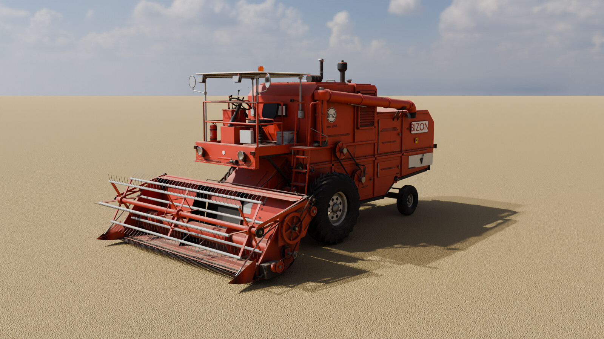
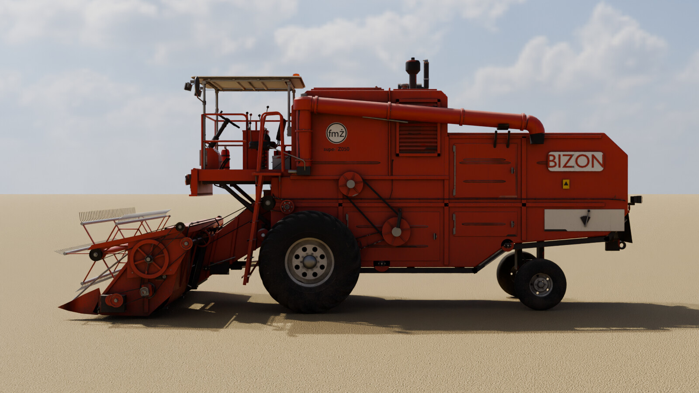
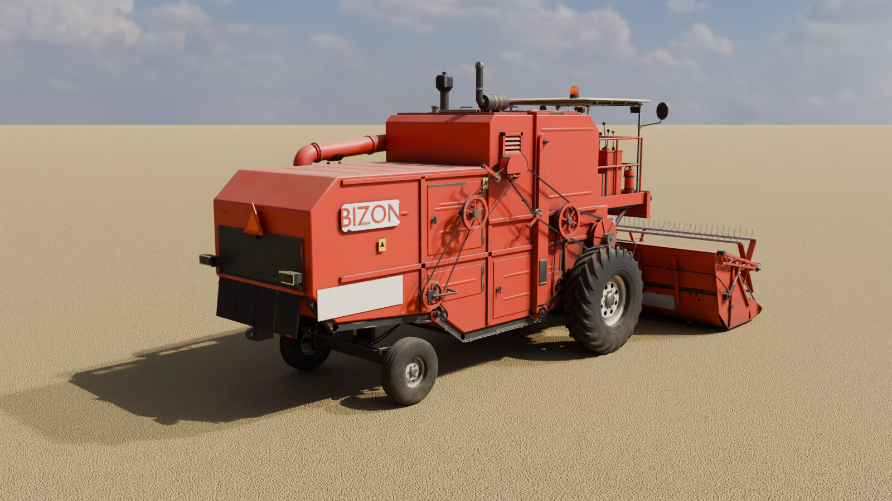
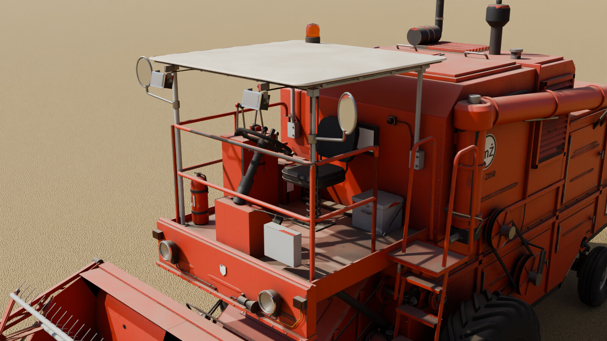
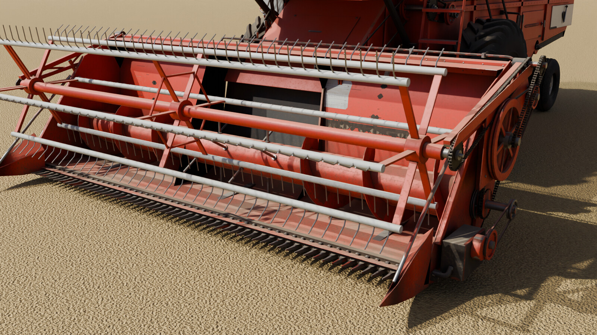
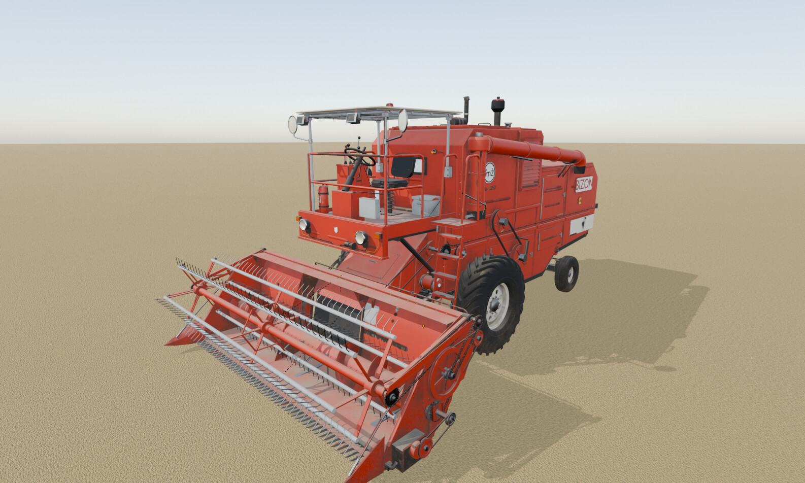

# Bizon Z050 Super z hederem 4,20 m – model 3D (Blender → FS25)

Model klasycznego polskiego kombajnu **Bizon Z050 Super** (FMŻ Bizon, 1973–76) z hederem zbożowym
**4,20 m**. Całość zbudowano skryptami Pythona wysyłanymi do działającego Blendera przez serwer
**MCP for Blender** (`execute_blender_code`, socket `127.0.0.1:9876`). Siatki, łączenie obiektów,
materiały, UV, wypalanie tekstur i eksport też wykonują te skrypty.



| | |
| --- | --- |
|  |  |
|  |  |

## Zawartość

| Ścieżka | Opis |
| --- | --- |
| `blend/bizon_z050_super.blend` | Scena Blendera 4.2 LTS: kombajn, heder, kolizje, słońce, niebo i kamery |
| `export/bizon_z050_super_fs25.fbx` | Eksport z wypalonymi materiałami atlasowymi (oś Y do góry, przód +Z jak w GIANTS) |
| `textures/` | Wypalone atlasy `*_diffuse.png`, `*_normal.png`, `*_specular.png` |
| `renders/` | Rendery Cycles |
| `scripts/` | Skrypty budujące model przez MCP (`lib.py` jest doklejany do każdego wywołania) |

## Co jest w modelu

Wymiary według danych technicznych Z050 Super, detale według zdjęć Z050/Z056 (widok kabiny z góry,
lewa strona hedera, prawa strona napędów):

- **Bryła:** długość z hederem ok. 8,2 m, szerokość bez hedera 3,15 m, wysokość do daszku 3,63 m.
  Koła przednie 18.4-30 (bieżnik R-1, kremowe felgi W16L-30 z otworami), tylne 10.00-15 na osi wahliwej.
- **Blachy:** rzędy nitów na żebrach, szwach i narożnikach zbiornika, przetłoczenia usztywniające,
  zawiasy piano i zamki z rączką T na drzwiach, ramy nośne i poprzeczki pod spodem, koryta ślimaków.
- **Stanowisko operatora (jak na zdjęciu Z050 z góry):** czerwona ściana przednia z okrągłymi
  reflektorami na wspornikach, skrzynka z zegarami na kolumnie kierowniczej, stacyjka i przełączniki,
  konsola dźwigni z kulisą biegów „H”, manetką gazu na zębatym sektorze i manometrem, fotel
  winylowy na sprężynie, trzy pedały z gumowymi osłonami, zbiornik paliwa, skrzynka narzędziowa,
  deska, gaśnica, lusterka, lampy robocze i kogut. Podłoga ma farbę wytartą do gołej blachy.
- **Napędy:** koła pasowe odlewane ze szprychami, wariatory bębna i jazdy (stożkowe tarcze, kosz
  sprężyny), paski klinowe, napinacze na ramieniu ze sprężyną, łańcuchy rolkowe na zębatkach
  (wentylator → ślimak ziarna, sito → ślimak kłosów, napęd przenośnika pochyłego), sprzęgło
  przeciążeniowe, łożyska kołnierzowe ze smarowniczkami, obudowa wentylatora z kratką, mimośród sita.
- **Elektryka:** wiązki z opaskami i przelotkami do każdej lampy, akumulator w skrzynce z czerwonym
  i czarnym przewodem, klakson, lampka zapełnienia zbiornika, wiązka tylna wzdłuż lewego boku,
  przewody do lamp roboczych i koguta po słupkach daszku, lampy tylne z kloszami i odblaskami.
- **Hydraulika:** zbiornik oleju z korkiem, odpowietrznikiem i wziernikiem, rozdzielacz z cięgnami
  do dźwigni, węże z zaciskanymi końcówkami do siłowników podnoszenia, szybkozłącza na przenośniku,
  orbitrol i stalowe przewody układu kierowniczego z obejmami do siłownika na tylnej osi.
- **Heder 4,20 m:** koryto, rozdzielacze, belka nożowa z 55 palcami (76,2 mm) i nożem, ślimak z
  przeciwbieżnymi zwojami i palcami, motowidło Ø 1,0 m z zębami sprężynowymi (ze zwojami),
  mimośrodowy pająk sterujący zębami, kratownicowe ramiona motowidła, wałek wejściowy z łożyskami,
  koło pasowe przekładni, łańcuchy do ślimaka (z napinaczem) i do motowidła, napęd noża, węże
  siłowników motowidła do szybkozłączy.

## Przygotowanie pod Farming Simulator 25

- Skala 1 jednostka = 1 m, model skierowany przodem do **−Y** w Blenderze (po eksporcie +Z w GIANTS).
- Modyfikatory (fazki, weighted normals) są zastosowane. Normalne niestandardowe dają ostre krawędzie i gładkie fazki.
- Ok. **300 tys. trójkątów** (korpus 113 tys., detale 80 tys., heder 71 tys., opony 36 tys.).
- Statyczne części są złączone w `bizonZ050_body` (duże blachy), `bizonZ050_details` (mechanika,
  elektryka, hydraulika, kabina) i `header420_body`. Klosze i szkła trafiły do `bizonZ050_lights`.
  Detale ruchomych zespołów (łańcuchy, zębatki, węże) są dołączone do odpowiednich części.
- Hierarchia z pivotami w miejscach obrotu:

```
bizonZ050                                 header420 (punkt zaczepu na przenośniku)
├─ bizonZ050_body                         ├─ header420_body
├─ bizonZ050_details                      ├─ knife            (ruch wzdłuż X)
├─ bizonZ050_lights                       ├─ auger → augerMesh (obrót X, z zębatką i sprzęgłem)
├─ feederHouse  (oś podnoszenia)          └─ reelArms (pivot ramion) → reelArmsMesh (z łańcuchem)
├─ feederLiftCylinders                        └─ reel → reelMesh (obrót X)
├─ steeringWheel (lokalna oś Z = kolumna)
├─ pipe (obrót Z) → pipeTube
├─ frontAxle → wheelFrontLeft/Right → tire*, rim*, hub*
└─ rearAxle (wahliwa, obrót Y) → steeringKnuckleRearLeft/Right → knuckle*, wheelRear* → tire*, rim*
   └─ rearAxleTieRod
```

- Proste bryły kolizji są w kolekcji `Z050_collision`. W widoku są ukryte (ikona oka). Przed
  eksportem i3d włącz ich widoczność i oznacz je w exporterze GIANTS jako kolizje.
- UV: cztery atlasy bez nakładania się UV: `bizonZ050` (4096²), `bizonZ050_details` (4096²),
  `header420` (4096²) i `bizonZ050_tires` (2048²).
- Tekstury: `*_diffuse` (sRGB), `*_normal` (tangent, konwencja OpenGL Y+) oraz
  `*_specular` spakowany jako **R = gładkość (1 − roughness), G = metaliczność, B = AO**.
  Sprawdź ten układ kanałów i kierunek zielonego kanału normal mapy z szablonem shadera, którego
  używasz w FS25, i w razie potrzeby przepakuj kanały. Pliki DDS utworzysz narzędziem GIANTS Texture Tool.

### Widok w Blenderze



Plik otwiera się z **wypalonymi materiałami** w trybie *Material Preview* ze słońcem i niebem sceny.
Wtedy w EEVEE widać wszystkie ślady zużycia, łącznie z przetarciami krawędzi, które w materiałach
proceduralnych działają tylko w Cycles. Obiekty pomocnicze (empty, kamery, kolizje) są ukryte
w nakładkach widoku.
Skrypt `fs25_switch_materials.py` w edytorze tekstu przełącza materiały:
`MODE = "PROCEDURAL"` przywraca materiały proceduralne (źródło do ponownego wypalenia),
`MODE = "BAKED"` wraca do atlasów.

### Eksport do i3d

1. Otwórz `blend/bizon_z050_super.blend` w Blenderze **4.2 lub 4.3** (tych wersji wymaga GIANTS I3D Exporter v10).
2. Siatki mają już wypalone materiały atlasowe (`MODE = "BAKED"`).
3. Wyeksportuj kolekcje `Z050_combine` i `Z050_header420` exporterem GIANTS. Następnie przypisz
   `vehicleShader.xml`, oznacz kolizje i ustaw wheels/attacherJoints w XML pojazdu. Heder to w FS osobny pojazd (cutter).

## Materiały PBR i zużycie

Proceduralne materiały PBR (`Z050_paint_red`, `Z050_paint_red_floor`, `Z050_paint_cream`,
`Z050_steel`, `Z050_chain`, `Z050_hose`, `Z050_wire`, `Z050_vinyl`, `Z050_wood` i inne) korzystają
z grupy węzłów `Z050_Weathering`. Grupa daje:

- wyblakły od słońca lakier, najmocniej na górnych powierzchniach;
- kurz na poziomych powierzchniach i brud w zagłębieniach;
- błoto rozbryzgane nisko przy kołach;
- odpryski na krawędziach i pojedyncze na płaszczyznach, z podkładem, gołą blachą i rdzą;
- nieliczne cienkie zacieki rdzy;
- plamy oleju przy łożyskach i hydraulice;
- podłogę i stopnie wytarte butami do gołej blachy;
- lekką falistość blach w normal mapie.

Maski krawędzi i AO działają w Cycles. Do gry (i do podglądu EEVEE) wszystko jest wypalone w atlasy.

## Odtworzenie modelu przez MCP

Wymagania: Blender 4.2 z włączonym dodatkiem MCP for Blender (serwer na `127.0.0.1:9876`) oraz
`uv tool install mcp-for-blender`.

```bash
cd bizon_z050/scripts
export BLENDER_HOST=127.0.0.1 BLENDER_PORT=9876
PY=~/.local/share/uv/tools/mcp-for-blender/bin/python
RUN="$PY mcp_client.py --lib lib.py"
$RUN --code 00_scene.py --code 01_materials.py --code 02_chassis.py --code 03_wheels.py \
     --code 04_operator.py --code 05_details.py --code 05b_drives.py --code 05c_electrics.py \
     --code 05d_hydraulics.py --code 05e_bodywork.py --code 06_header.py --code 07_finalize.py
for a in bizonZ050 bizonZ050_details header420 bizonZ050_tires; do   # UV, one atlas per call
  (echo "ATLAS = '$a'"; cat 07b_uv.py) > /tmp/uv_$a.py && $RUN --code /tmp/uv_$a.py
done
$RUN --code 08_render_setup.py
$RUN --code 09_bake.py     # wypalanie w tle (ok. 25 min), postęp: textures/bake_status.txt
$RUN --code 10_export.py   # FBX + zapis .blend
```

Skrypty zapisują pliki w `/tmp/hoplite/workspace/bizon_z050`. Przy innej lokalizacji zmień stałe
`OUT`/`BASE` w `09_bake.py`, `10_export.py` i `render_job.py`.
